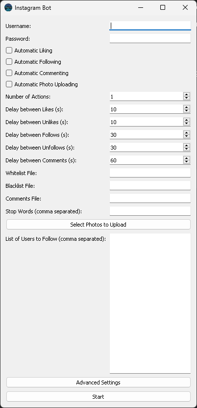

# Igbot-Instagram Bot 🤖📸

<p align="center">
  
</p>

This project is an Instagram Bot built using PyQt5 and Selenium, enabling automation of various actions on Instagram such as liking, following, commenting, and uploading photos.

## 🌟 Features
- Automatic liking of posts
- Automatic following of users
- Automatic commenting on posts
- Automatic photo uploading
- Advanced settings for user filtering and delay configuration between actions

## 📋 Requirements
- Python 3.x
- PyQt5
- Selenium
- Webdriver Manager

## 🛠️ Installation
First, ensure you have all the required packages installed. If not, the `install.py` script will automatically install them:

```python
import sys
import subprocess

# Function to check installed packages
def check_and_install(package):
    try:
        __import__(package)
    except ImportError:
        subprocess.check_call([sys.executable, "install.py"])

# List of packages to check
required_packages = [
    "PyQt5",
    "selenium",
    "webdriver-manager"
]

# Check and install packages
for package in required_packages:
    check_and_install(package)
```

## 🚀 Usage
1. Launch the application:

    ```bash
    python main.py
    ```

2. Fill in the required information in the user interface:
    - Username and password
    - Automation options (liking, following, commenting, uploading photos)
    - Number of actions
    - Advanced settings

3. Click the **Start** button to run the bot.

## 💻 User Interface
<p align="center">
  
</p>

### Basic Settings
- **Username**: Enter your Instagram username.
- **Password**: Enter your Instagram password.
- **Automatic Liking**: Check if you want to automatically like posts.
- **Automatic Following**: Check if you want to automatically follow users.
- **Automatic Commenting**: Check if you want to automatically comment on posts.
- **Automatic Photo Uploading**: Check if you want to automatically upload photos.
- **Number of Actions**: Set the number of actions the bot should perform.

### Advanced Settings
- **Delay between Actions**: Set the delay between individual actions (likes, unfollows, follows, etc.).
- **Filter Users**: Filter users based on various criteria (number of followers, following, followers/following ratio, etc.).
- **Whitelist/Blacklist File**: Set files for whitelisting and blacklisting users.
- **Stop Words**: Set stop words that the bot will not use in comments.

## 🐞 Reporting Issues
If you encounter a bug, please open an issue on GitHub and include a detailed description of the problem along with the error message.

## 🤝 Contributing
Contributions to the project are welcome! Please open a pull request with your changes and describe what and why you have changed.

## 📄 License

<p align="center">────── 𝓼𝓿𝓮𝓽𝓳𝓮𝓸𝓷𝓵𝓲𝓷𝓮 ──────</p>
